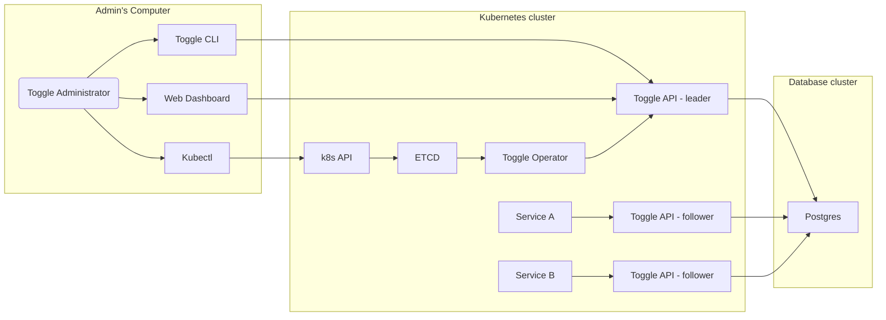
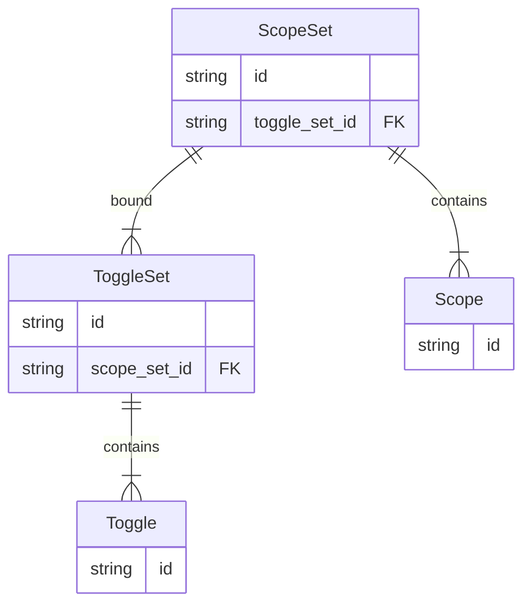
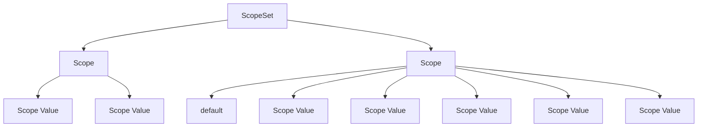
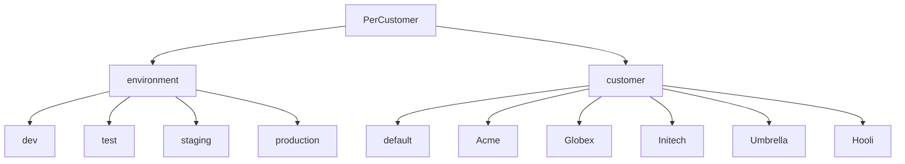

# toggle

Toggle is a simple feature flagging API

## contributions

Pull requests welcomed. ❤️

## license

MIT licensed. See [licenses](./licenses) for more details.

## development

### taskfile

This project uses [Taskfile](https://taskfile.dev) to manage build steps.

To install: `go install github.com/go-task/task/v3/cmd/task@latest`

After installing you can list the available tasks: `task --list`

```bash
❯ task --list
task: Available tasks for this project:
* build:              Build the Toggle API server and CLI client
* build-docker:       Generate the docker image
* generate:           Generate connect-go/gRPC integration code
* run:                Run Toggle from source
* run-docker:         Run Toggle from the Docker image
* setup:              Install tools needed to develop Toggle
```

### setup

To install the Go binaries necessary for development, install Taskfile and then run: `task setup`

### building the Docker image

To build the Docker image for the Toggle API server locally run: `task build-docker`

To run the image there's a convenience function: `task run-docker`

An example of how to connect to the newly created server: `task run -- client create-scope`

## design

### overview



The name _Toggle_ was chosen because it provides a semi-opinionated method for managing feature flags. Current home-rolled feature flag systems often end up with a murky binary enable/disable pattern for features that can lead to confusion. ("What does it mean to enable the `DisableFeatureX` flag?")

Toggle tries to side step this issue by having an opinion; feature flags are called `Toggles` and are _toggled_ (think "light switch") to be either _on_ or _off_. This leads to shorter feature names (`FeatureX` instead of `EnableFeatureX`) with a cleaner understanding of what toggling it on means ("`FeatureX` is enabled"). This however necessitates that any behavior to be toggled must be described in terms of being on or off.

One design consideration is that toggle is for _feature flagging and is not a general configuration management tool_. It does not support switches for non-boolean values (eg. `ApiTimeoutInSeconds`) and is unlikely to in the future. For these cases a general purpose configuration tool should be used instead. Ignoring non-binary use cases allows Toggle to be very performant even in high-traffic environments that may make thousands of lookups per second.

### data structures



A _toggle set_ is a collection of multiple feature _toggles_ that are logically grouped and allows for turning them all on or off as a single switch.

An example use case would be the ability to toggle on a complete set of features that represents optional capabilities that an enterprise customer would have access to.

Imagine the scenario where sales is attempting to upsell a new customer by providing a preview of the features available to them at an enterprise tier. In this case it would be appropriate to toggle (on a per tenant basis) the feature set for enterprise.

### scoping

Scoping is the process of identifying which `Toggle` values should be applied to the
incoming request.

Scope is identified by a `ScopeSet` which is a collection of `Scope` attributes that can be used to refine granularity. For example, a `ScopeSet` might contain two `Scope` attributes; one for "environment" and one for "customer". Using this type of `ScopeSet` would allow you to set different toggles for each customer and provides a convenient strategy for rolling out new features on a per customer basis.

`Scope` attributes can be either _required_ or _optional_ (the default). A required `Scope` must be passed with every lookup request; not passing it will result in an error. An optional `Scope` will receive a default value if omitted. Required `Scopes` are useful when you want to make sure not to accidentally fall back to an invalid default value. For example, for an "environment" `Scope` you would not want to accidentally default to "test" for all environments.

An optional `Scope` will receive a default value if omitted. Optional `Scopes` are useful for when you will only be customizing the `Toggle` values for specific cases, but are OK with using a sensible default value for all other cases. For example, for a "customer" `Scope` you may want to have a default profile for all customers that you only customize for individual customers on request.

Each `Scope` is defined along with a finite set of acceptable values for that `Scope`. We do this for performance reasons; having too much scope cardinality can lead to poor memory utilization patterns and slow lookups leading to high request latency. In the future we may re-evaluate these limits to the Toggle API based on real-world usage.

`ScopeSet` limits:

| Name               | Limit          |
| ------------------ | -------------- |
| Scope values       | 1000 values    |
| Scope value length | 255 characters |
| Number of scopes   | 5 scopes       |

### toggling

Toggling is the underlying reason for this service. A `ToggleSet` is a related group of feature `Toggles` that can be turned off or on as a group or individually.





Each `ToggleSet` is bound to a `ScopeSet` that defines the granularity allowed for customizing the `ToggleSet` and `Toggle` values. This relationship provides an efficient way to lookup the relevant `ToggleSets` and `Toggles` for an incoming Toggle API request.

### use of default values

It is _highly_ recommended that a toggle and toggle sets default value is set to `TOGGLE_OFF`. This is because gRPC does not bother to encode and send a field whose value matches its default value; the field is not transmitted on the wire and is instead only populated (inflated) during the decoding phase using the defined protobuf schema. This means there is a substantial savings on both network transfer latency and the message encoding/decoding for requests that are primarily sending or receiving default values.

For example, suppose you have the following toggle set:

```
\- enterprise (default = off)
  \- single_sign_on (default = off)
  \- custom_domains (default = off)
  \- support_dashboard (default = off)
```

For each case where a customer is non-enterprise (the default) there will be no toggle set payload sent in the response. Instead, the receiving client will automatically inflate the response with the correct default values saving considerable time and network bandwidth.

This technique is also utilized when serializing/deserializing the toggle set to persistent storage allowing for even large numbers of toggles to be efficiently stored and retrieved.

## examples

Gives examples for the overall operational lifecycle of a feature flag from creation to use.

This cycle is roughly:

1. Create a new scope
2. Create a feature flag
3. Assign a value to the feature flag
4. (Optional) List all of the flags available. This is mainly useful for building UIs to manage the flag set.

### create a new scope

#### defining scope

The most complicated part of feature flagging is defining the situation under which a toggle's value applies. (Commonly called "scope".)

Toggle allows the operator to define their own scoping strategy in order to service a wider range of use cases.

Common scoping strategies supported include:

-   Scoping by the environment (eg. `development`, `staging`, `production`) that the flag applies to.
-   Scoping by tenant (eg. `customer_a`, `customer_b`, `customer_c`)
-   Scoping by mode (eg. `enterprise`, `experimental`, etc.)

### create a new feature flag

### assign a value to the flag

### list all flags

## CLI usage

### Setup basic customer feature toggles

```bash
# Create a Scope Set
> toggle create-scope-set \
    --name 'PerCustomer' \
    --desc 'Toggle values on a per customer basis for smooth feature rollout' \
ScopeSet{Id: ss-1}

# Create the Scopes and bind them to the Scope Set via its ID
> toggle create-scope \
    --scope-set-id='ss-1' \
    --required true \
    --name 'environment' \
    --desc 'The runtime environment of the service' \
    --value 'dev' --value 'staging' --value 'prod'
Scope{}

> toggle create-scope \
    --scope-set-id='ss-1' \
    --required false \
    --name 'customer' \
    --desc 'The customer the user belongs to' \
    --value 'Acme' --value 'Globex' --value 'Initech' --value 'Umbrella' --value 'Hooli'
Scope{}

# Create a new Toggle Set
> toggle create-toggle-set \
    --scope-set-id='ss-1' \
    --name 'Experimental' \
    --desc 'Toggles for experimental features'
ToggleSet{Id: ts-1}

# Bind some Toggles to the Toggle Set via its ID
> toggle create-toggle \
    --toggle-set-id='ts-1' \
    --name 'new_dashboard' \
    --desc 'The new dashboard experience' \
    --default 'OFF'

> toggle create-toggle \
    --toggle-set-id='ts-1' \
    --name 'feature_x' \
    --desc 'Secret Feature X' \
    --default 'OFF'
```

### Seeing available scopes and toggles

```bash
> toggle list-scopes

| Scope Set   | Scope       | Description                            |
| ----------- | ----------- | -------------------------------------- |
| PerCustomer | environment | The runtime environment of the service |
| PerCustomer | customer    | The customer the user belongs to       |

> toggle list-toggles

| Toggle Set   | Toggle        | Description                  |
| ------------ | ------------- | ---------------------------- |
| Experimental | new_dashboard | The new dashboard experience |
| Experimental | feature_x     | Secret Feature X             |

> toggle list-scope-sets

| Scope Set   | environment | customer |
| ----------- | ----------- | -------- |
| PerCustomer | dev         | *        |
| PerCustomer | dev         | Acme     |
| PerCustomer | dev         | Globex   |
| PerCustomer | dev         | Initech  |
| PerCustomer | dev         | Umbrella |
| PerCustomer | dev         | Hooli    |
| PerCustomer | test        | Acme     |
| PerCustomer | test        | Globex   |
| PerCustomer | test        | Initech  |
| PerCustomer | test        | Umbrella |
| PerCustomer | test        | Hooli    |
| PerCustomer | staging     | Acme     |
| PerCustomer | staging     | Globex   |
| PerCustomer | staging     | Initech  |
| PerCustomer | staging     | Umbrella |
| PerCustomer | staging     | Hooli    |
| PerCustomer | production  | Acme     |
| PerCustomer | production  | Globex   |
| PerCustomer | production  | Initech  |
| PerCustomer | production  | Umbrella |
| PerCustomer | production  | Hooli    |

> toggle list-scope-ids

| Scope ID                 |
| ------------------------ |
| PerCustomer:dev:*        |
| PerCustomer:dev:Acme     |
| PerCustomer:dev:Globex   |
| PerCustomer:dev:Initech  |
| PerCustomer:dev:Umbrella |
| PerCustomer:dev:Hooli    |

> toggle list-toggle-ids

| Toggle ID                  |
| -------------------------- |
| Experimental:new_dashboard |
| Experimental:feature_x     |


> toggle list-toggle-values

| Scope ID                 | Toggle ID                  | Value |
| ------------------------ | -------------------------- | ----- |
| PerCustomer:dev:*        | Experimental:new_dashboard | ON    |
| PerCustomer:dev:Acme     | Experimental:new_dashboard | ON    |
| PerCustomer:dev:Globex   | Experimental:new_dashboard | ON    |
| PerCustomer:dev:Initech  | Experimental:new_dashboard | OFF   |
| PerCustomer:dev:Umbrella | Experimental:new_dashboard | ON    |
| PerCustomer:dev:Hooli    | Experimental:new_dashboard | ON    |
```

### Updating toggles

```bash
> toggle set-toggle-value \
    --scope-id PerCustomer:dev:Acme \
    --toggle-id Experimental:new_dashboard \
    --value ON
```

## features to support

-   [ ] Docker image creation and publishing
-   [ ] Setting and getting scope
-   [ ] Creating and updating toggle sets and toggles
-   [ ] Leader election and multiple instances of API server
-   [ ] Toggle local caching and performance improvements
-   [ ] Kubernetes deployment manifests
-   [ ] Toggle API CRDs and Kubernetes operator
